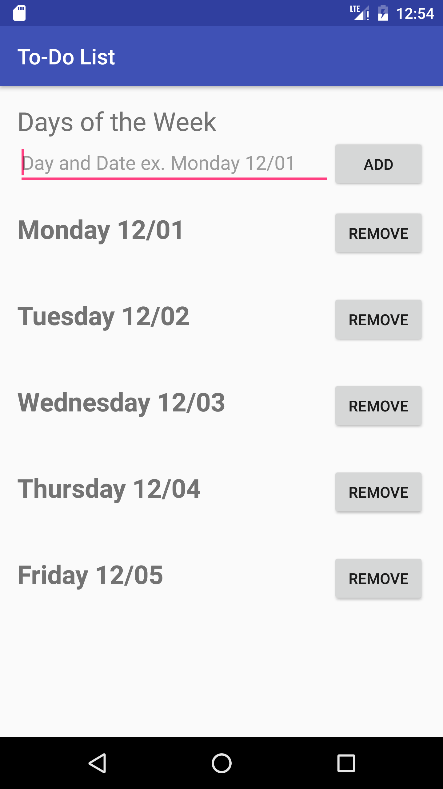
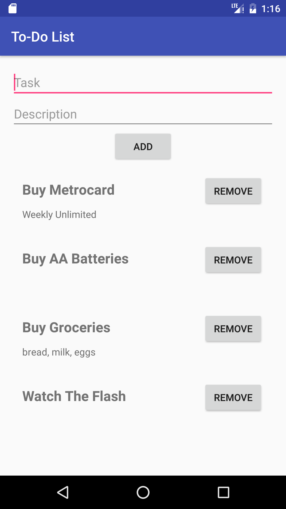

## To-Do List

**To-Do List** is an app that allows users to create and remove to-do lists.  Each to-do list should be titled by the day of the week and the date of that day.  In addition, allow users to add and remove tasks and descriptions for each day.  The user have the option to add a description for each task.  **To-Do List** displays correctly in both landscape and portrait orientations.

**Screenshots**

  
  

