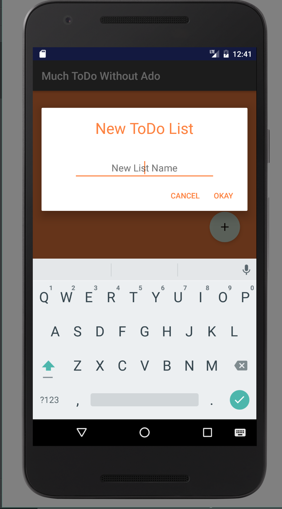
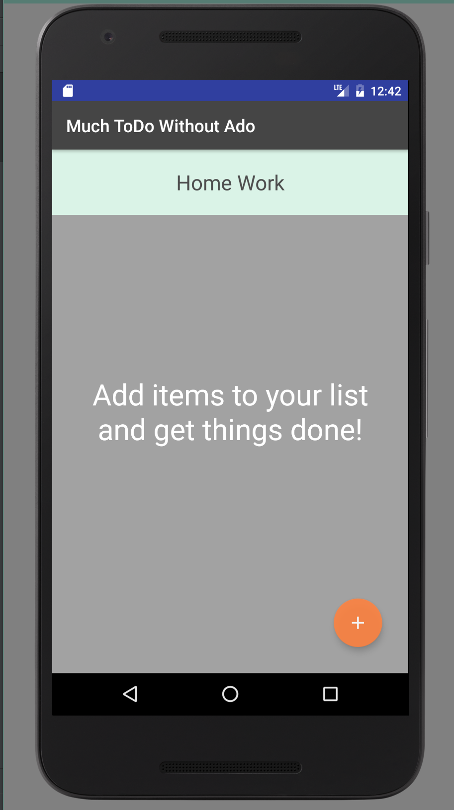
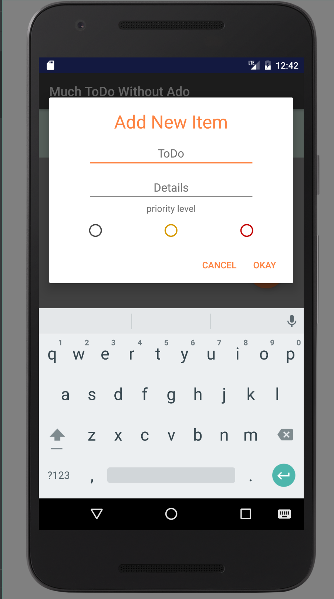

# Much ToDo Without Ado

#### Overview

This app creates to do lists to keep track off all the things you'll never actually do.

---

#### Features

- User can create as many lists as they'd like
- User can add items to each list with the option to enter details and priority level
- Added items can be edited or removed from a list
- Items can be checked off from a list
- Entire lists can also be removed

---

#### Known Bugs

- Currently, data is not persisted upon termination of the application
- If the user is inputting data (either for an item or a new list) and he/she changes the orientation of the screen, the input box closes

---

#### Screenshots 

  
  
  
  
  

---

