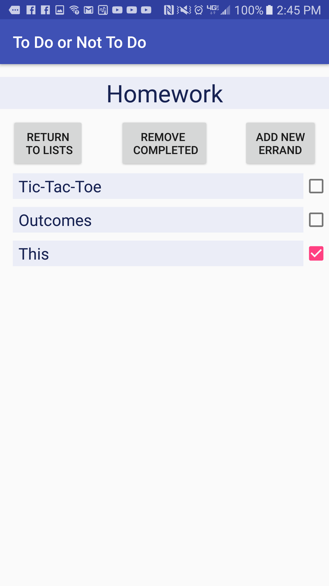
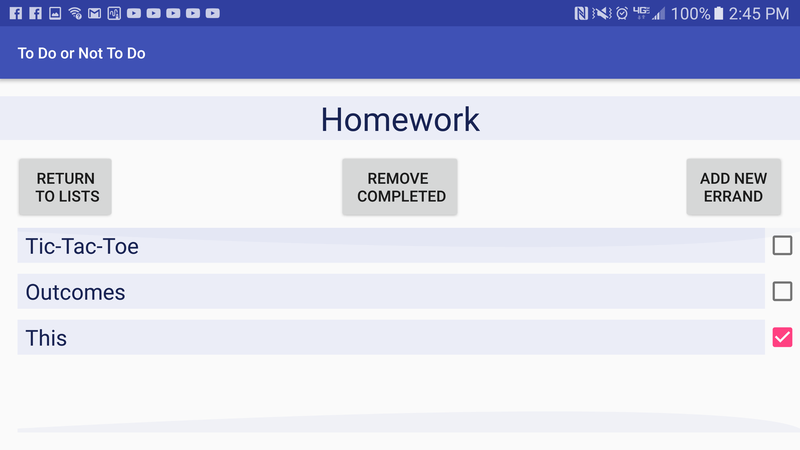
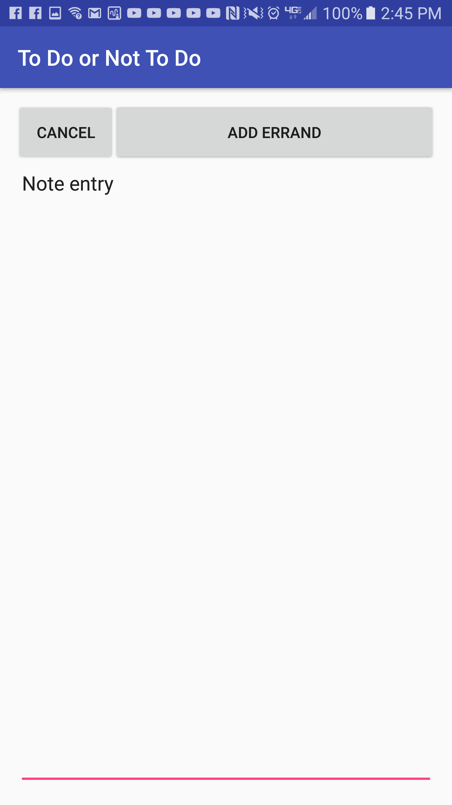

#  Project #1: To-Do List

#### Overview

A basic To-Do app list. The main screen allows the user to create a generalized To-Do list with a name and description. This can be something like Groceries, Shopping, Homework. Each of these To-Do lists can then be opened in order to add specific errands to that To-Do list. Once a task is done the user can either long-click a specific item to delete it or check off multiple objects and remove them all with the “Remove Completed” button. If a user is done with an entire To-Do list they can just long click the To-Do list in order to delete it. Whenever the user is about to delete a note, a prompt dialog is opened up to confirm with the user that that is their intent.

What to expect in future updates:
-Currently the imageView has only a background color as a placeholder. Later down the line I want to incorporate icons for different types of To-Do lists.
-Include persist data storage that will allow the user to store data after the app is closed. *Pretty important*
- Allow user to edit To-Do list items, title and/or description.
- Allow user to set alarm reminders.
- Allow user to record and listen to voice memos.

  
  
  
  

