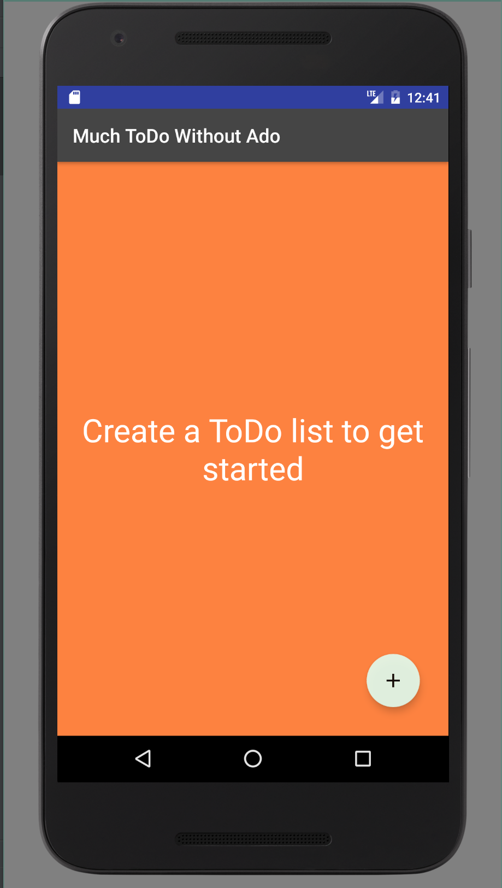

#  Project #1: To-Do List

#Features of Life Organizer
##Main Activity
- Create a new to-do list by clicking plus icon on the homepage. Input cannot be empty.
— Short click on item takes user to the second activity (ToDoItemActivity)
— Long item click on list triggers alert dialog box. From the alert dialog box; the user can rename or delete the list.

##ToDoItemActivity
- Create a new to-do list item by clicking plus icon on the homepage. Inputs cannot be empty. If item description elements are entered with a line break; the description field is formatted as a bullet list.
— Long item click on item triggers alert dialog box. From the alert dialog box; the user can rename or delete the item.

##Screenshot

  

