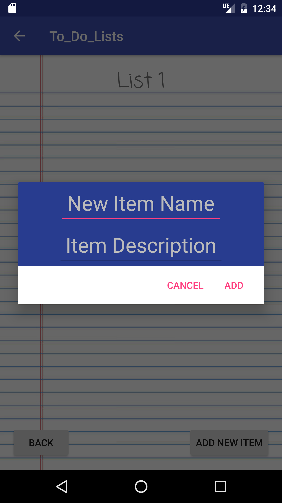

#/Users/colinbradley/Projects/Project1/project-1/readme.md  Project #1: To-Do List

#### Description
- app opens into the view of lists(blank when fresh start)
- “Add List” button on the bottom opens up an AlertDialog to input a new list
- the AlertDialog holds a single edit text with a cancel button and an add button
- list name cannot be blank, trying to add a blank list will return an error toast
- once the add button is clicked and it has checked that it isn’t blank it adds a new  list to the singleton (consisting of a list of list names and a hash map to organize the items and their description) and then notifies the data change to the adapter
- the view of lists is now updated to show the new list
- the new list on the screen has 2 parts (textview and a new button to remove)
- the remove button removes the list it is associated with and notifies the adapter
- clicking on the rest of the row starts a new intent that opens the items view and assigns the list name to the top of the item view
- 2 buttons now appear on the bottom of the of the screen (a “back” button and an “add item” button)
- the back button will simply call finish() and revert back to the view of lists
- the add item button will open a new AlertDialog
- this dialog has 2 edit texts and the same buttons as the add list dialog
- the item name field cannot be empty but the description is optional
- once the add button is clicked it adds the item and its description into the singleton and notifies the change to the adapter once again
- the new item now appears on the screen and it is a similar layout as the list but with 2 text views
- remove button works the same as the list one and removes the list associated and notifies the adapter
- the textviews don’t have any function or intent
- the info is held on the singleton for the entire time the app is open but unfortunately it cannot save info for separate openings (yet) 

#### Screenshots

  
  
  
  
  
  
  
  

---

## Licensing
1. All content is licensed under a CC­BY­NC­SA 4.0 license.
2. All software code is licensed under GNU GPLv3. For commercial use or alternative licensing, please contact [legal@ga.co](mailto:legal@ga.co).
